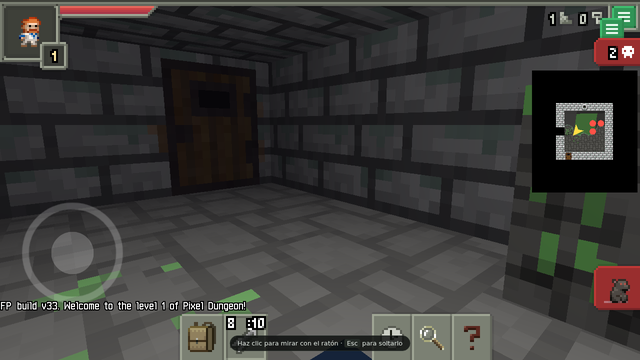
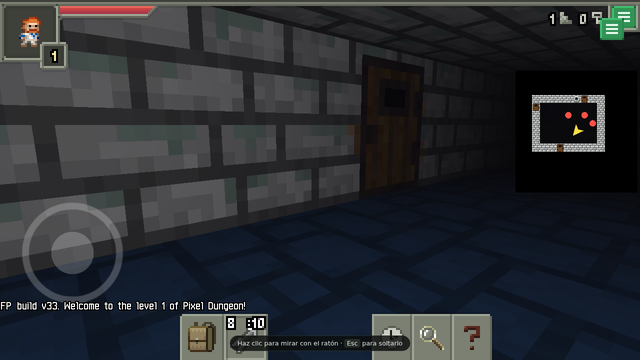

# PixelDoomgeon

**[Sprouted Pixel Dungeon](https://github.com/dachhack/SproutedPixelDungeon)
turned into a first-person grid crawler.** Same turns, same grid, same
items, same bosses — you just look at it from inside.

### ▶ [Play it in your browser](https://pixeldoomgeon.jaliscomundial.com/juego/)

No install, no account. There is also a
[boss arena](https://pixeldoomgeon.jaliscomundial.com/arena/): pick a boss,
a class and your gear out of all 91 items, and go straight at it. Yog
included.

<p align="center">
  
  
</p>

## What this actually is

A fork of Sprouted with its presentation layer replaced. **The game logic
is untouched** — turns, the grid, potion identification, curses, Goo,
Tengu, DM-300, the Dwarf King, Yog. All of it runs exactly as dachhack
wrote it. What changed is that the top-down tilemap became geometry and
the camera went inside the dungeon.

**Built on Watabou's Noosa engine, with no 3D library.** Sprouted forked
Shattered at ~0.2.4, long before the libGDX migration, so underneath is
the old engine talking straight to `android.opengl.GLES20`. Noosa turned
out to already have the pipeline for this: its vertex shader is
`gl_Position = uCamera * uModel * aXYZW`, with a `vec4` position. What was
missing was a perspective camera, vertices with a Z, and a depth buffer —
which Noosa never asked for.

The deciding detail was that `PixelScene.uiCamera` is a separate camera
from `Camera.main`. Changing only what `Camera.main` draws leaves the
inventory, the toolbar and every window intact. Swapping in libGDX would
have meant rewriting that whole UI.

Monsters and items are billboards of their original sprites, on purpose.
Watabou drew the creatures as upright three-quarter portraits even though
the map was top-down — look at `rat.png` — so they already face you.

## Status

Playable start to finish, in a browser, today. Android is the target but
there is no Play Store build yet.

Things that are known to be rough: the deeper floors have not had as many
eyes on them, and effect particles that belong to many cells at once
(fire, embers, poison clouds) are hidden in first person rather than
misplaced.

## Credits

This is a fan project and is not affiliated with any of the people below.
Their work is the reason it exists.

- **[Watabou](https://github.com/watabou/pixel-dungeon)** — Pixel Dungeon,
  and the Noosa engine this is built on.
- **[Evan Debenham](https://github.com/00-Evan/shattered-pixel-dungeon)** —
  Shattered Pixel Dungeon.
- **[dachhack](https://github.com/dachhack/SproutedPixelDungeon)** —
  Sprouted Pixel Dungeon, the direct upstream.

Built with AI assistance. I am not a native English speaker and I had help
with a good part of the code; the direction, the testing and the calls
about how it should feel are mine.

## Building

The Android build needs JDK 21 and an Android SDK:

```sh
JAVA_HOME=/usr/lib/jvm/java-21-openjdk-amd64 \
ANDROID_HOME=/path/to/android-sdk \
./gradlew :app:assembleDebug
```

`compileSdk`/`targetSdk` 35, `minSdk` 21. **`sourceCompatibility` has to
stay at 1.8**: the Sokoban level layouts use `_` as a variable name, which
became a reserved word in Java 9.

The browser build is a separate project —
[pixeldoomgeon-web](https://github.com/Magno666/pixeldoomgeon-web) — which
compiles this code to JavaScript with TeaVM and supplies the Android
classes the game expects.

`tools/README.md` has the notes on how this build was assembled from
upstream, including the parts that do not compile as-is.

## License

**GPL-3.0-or-later**, same as Sprouted. See `LICENSE.txt`.

The code is public because the license requires it and because that is the
right way to treat work built on somebody else's.
